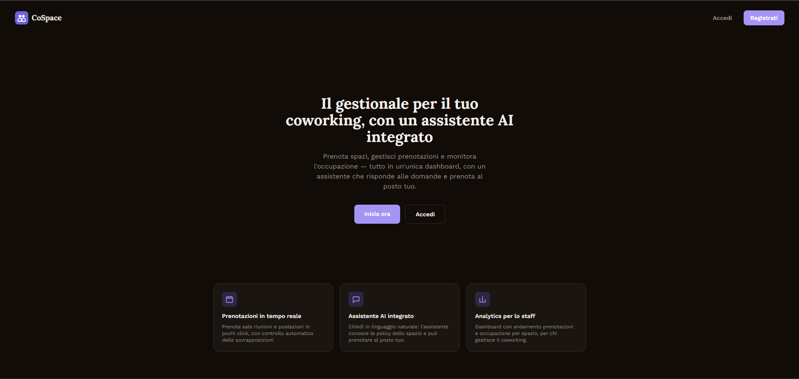
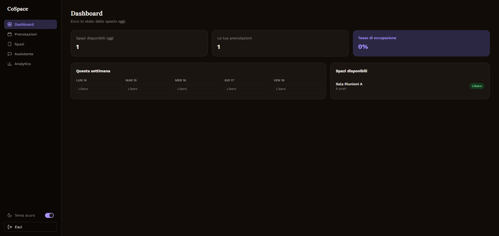
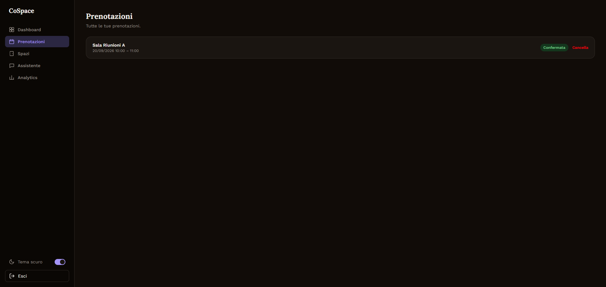
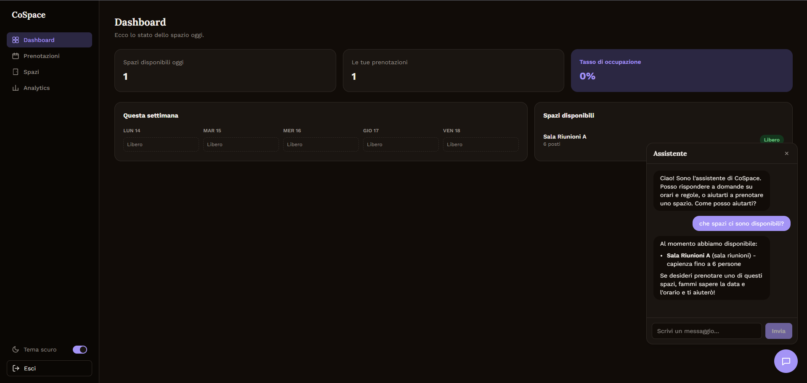
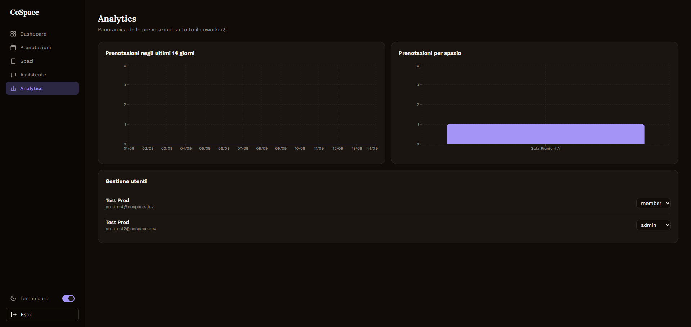
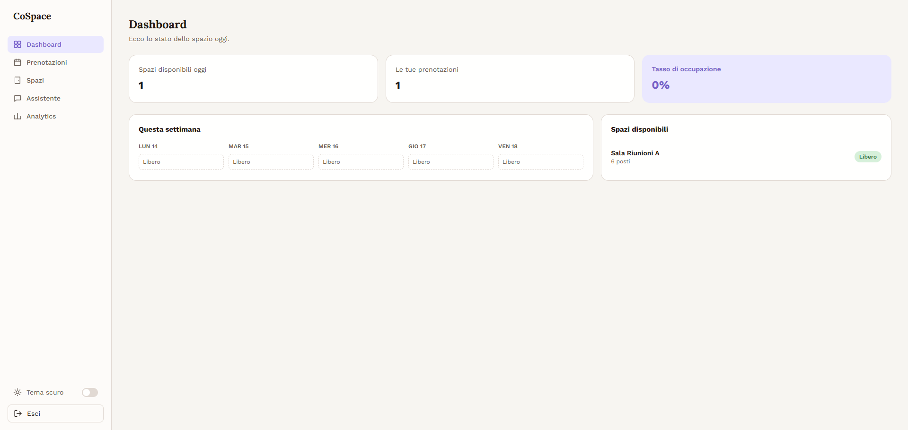

# CoSpace

Gestionale per spazi di coworking con un assistente AI integrato — prenotazioni in tempo reale, dashboard analitica per lo staff e un assistente conversazionale che combina RAG (ricerca semantica sulle policy dello spazio) con tool-calling agentico (query/azioni dirette sul database di prenotazioni).

**Demo live:** [co-space-pied.vercel.app](https://co-space-pied.vercel.app)
**API docs (Swagger):** [cospace-api-586611297528.europe-west1.run.app/docs](https://cospace-api-586611297528.europe-west1.run.app/docs)

[](https://github.com/VittorioFiorita/CoSpace/actions/workflows/ci.yml)

## Screenshot

**Landing page**



**Dashboard**



**Prenotazione spazi**


**Le tue prenotazioni**



**Assistente AI** — widget flottante disponibile su ogni pagina, combina RAG (policy dello spazio) e tool-calling (prenotazione in linguaggio naturale)



**Dashboard analitica (staff)**



<details>
<summary>Tema chiaro</summary>



</details>

## Cos'è

CoSpace è un gestionale prenotazioni per spazi di coworking (sale riunioni, scrivanie): i membri prenotano spazi e gestiscono le proprie prenotazioni, lo staff/admin ha accesso a una dashboard analitica e alla gestione ruoli utenti. La caratteristica distintiva è l'assistente AI: non un semplice chatbot, ma un agente che combina due tecniche diverse —

- **RAG (Retrieval-Augmented Generation)**: ricerca semantica (embedding + pgvector, cosine similarity) su un documento di policy del coworking (orari, regole di cancellazione, ecc.) — per rispondere a domande in linguaggio naturale con contesto reale, non allucinato
- **Tool-calling agentico**: l'assistente può interrogare ed eseguire azioni reali sul database (elencare spazi disponibili, prenotare per conto dell'utente, elencare le proprie prenotazioni) tramite un loop di tool-use con l'API di Claude

## Funzionalità

- Autenticazione JWT con ruoli (member / staff / admin)
- Prenotazione spazi con controllo automatico delle sovrapposizioni
- Dashboard con stato dello spazio in tempo reale (calendario settimanale, disponibilità)
- Dashboard analitica per lo staff (andamento prenotazioni, popolarità per spazio) con grafici Recharts
- Gestione ruoli utenti (admin)
- Assistente AI come widget flottante, accessibile da ogni pagina (RAG + tool-calling)
- Rate limiting per-utente sull'endpoint dell'assistente
- Tema chiaro/scuro
- Landing page pubblica, responsive

## Stack tecnico

**Frontend** — Next.js 16 (App Router, Turbopack), React 19, TypeScript, Tailwind CSS v4, TanStack Query, Recharts

**Backend** — FastAPI, SQLModel + Alembic, PostgreSQL (Neon, serverless con branching dev/production), pgvector per la ricerca semantica

**AI** — Anthropic Claude (Haiku) per il tool-use loop, embedding locali (`sentence-transformers`, `all-MiniLM-L6-v2`) per l'indicizzazione RAG

**Infra** — Docker, GitHub Actions CI (lint, build, test su ogni push), deploy su Vercel (frontend) + Google Cloud Run (backend) + Neon (database)

## Architettura

```
┌─────────────┐      HTTPS       ┌──────────────┐      SQL/pgvector    ┌─────────────┐
│  Next.js     │ ───────────────▶ │   FastAPI     │ ────────────────────▶ │  PostgreSQL │
│  (Vercel)    │ ◀─────────────── │  (Cloud Run)  │ ◀──────────────────── │  (Neon)     │
└─────────────┘      JSON/JWT    └──────┬───────┘                       └─────────────┘
                                          │
                                          │ tool-use loop
                                          ▼
                                  ┌──────────────┐
                                  │  Claude API   │
                                  │  (Haiku)      │
                                  └──────────────┘
```

## Sviluppo locale

Prerequisiti: Node 20+, Python 3.14, un database Postgres con estensione `pgvector` (es. un progetto Neon gratuito).

```bash
# Backend
cd apps/api
python -m venv .venv
.venv\Scripts\activate          # Windows
pip install -r requirements.txt
cp .env.example .env            # compila DATABASE_URL, SECRET_KEY, ANTHROPIC_API_KEY
alembic upgrade head
python -m app.index_knowledge   # indicizza la knowledge base per il RAG
uvicorn app.main:app --reload

# Frontend (altro terminale)
cd apps/web
npm install
cp .env.example .env.local      # NEXT_PUBLIC_API_URL=http://localhost:8000
npm run dev
```

## Test e CI

```bash
cd apps/api
pytest
```

GitHub Actions esegue lint + build sul frontend e test + smoke-test sul backend ad ogni push.

## Scelte architetturali degne di nota

- **RAG + tool-calling separati, non confusi**: solo il documento di policy usa la ricerca vettoriale; le query su spazi/prenotazioni (dati strutturati) passano per tool-calling diretto sul DB, non per RAG — distinzione tecnica precisa, non solo terminologica.
- **Cold start accettato consapevolmente**: `sentence-transformers`/`torch` vengono caricati una sola volta per processo (`@lru_cache`), quindi il costo è un delay di pochi secondi solo sulla primissima richiesta all'assistente dopo un periodo di inattività su Cloud Run — scelta esplicita rispetto a pagare per un'istanza sempre attiva, ragionevole per un progetto a basso traffico.
- **Rate limiting in-memory**: sliding window per-utente (20 msg/ora) sull'endpoint dell'assistente, per proteggere il budget dell'API Claude — non persistente/distribuito, tradeoff accettabile alla scala attuale.
- **Deploy manuale, non ancora CI/CD completo**: il backend viene distribuito con `gcloud run deploy` da terminale; automatizzarlo con GitHub Actions è il prossimo passo pianificato.
